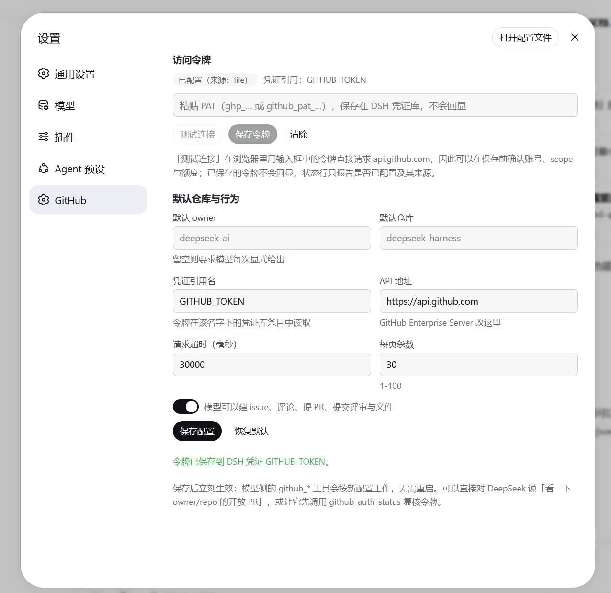

# dsh-github-toolkit

English | [中文](README.zh.md)

GitHub for [DeepSeek Harness](https://github.com/deepseek-ai/deepseek-harness): 18 agent-facing `github_*` tools, plus a **GitHub page in Web Settings** that stores your PAT in the DSH credential store and takes effect without a restart.

No build step, no runtime dependencies — the host half uses Node's built-in `fetch`, the browser half requires only `react` and the shell's static UI primitives.

- **The token never lives in configuration.** It is resolved from the DSH credential store by reference (default `GITHUB_TOKEN`) on every request, so rotating the PAT applies to the next call and `cordis.patch.yml` never contains a secret.
- **Configured in the GUI, not the terminal.** Paste the PAT, test it against `api.github.com` from the page before saving, bind a default repository, and switch the write tools on or off.
- **Failures name the fix.** 401 → rotate the token; 403 with zero quota → when it resets; 403 otherwise → scopes or SAML SSO; 404 → missing or unauthorized; 422 → GitHub's own field-level errors.

## Requirements

- DeepSeek Harness `0.1.5-rc.1` or newer (`@deepseek-ai/dsh-tools` and `@deepseek-ai/dsh-credentials` are peers the harness provides).
- Node.js 22+ (the host half uses `AbortSignal.any`).
- A GitHub personal access token; fine-grained tokens are recommended.

## Install

```sh
dsh plugin --profile web add dsh-github-toolkit
```

The package declares `dsh.bundle`, so the installer adds it to the profile's bundle list and the row in `cordis.patch.yml` mounts the host half. Then refresh the Web UI and open **Settings → GitHub**.

Without npm:

```sh
dsh plugin --profile web add github:<owner>/dsh-github-toolkit
```

No build scripts are involved, so this installs straight from the repository.

## Set it up in the GUI

Open **Settings** from the bottom-left of the Web UI, then pick **GitHub**:



1. Refresh the Web UI and open **Settings → GitHub**.
2. Paste the PAT → **Test connection** (the page calls `api.github.com` directly, so you see the account, scopes, and remaining quota *before* anything is stored) → **Save token**.
3. Optionally set **default owner** / **default repository** and save the configuration.

| Section | What it does |
|---|---|
| Access token | Shows whether a token is configured and where it comes from (credential store / launch environment); password field to paste one; Test connection; Save; Clear |
| Defaults & behaviour | Default owner, default repository, credential reference name, API base (GitHub Enterprise Server), request timeout, page size, **write access** switch; Save configuration; Reset to defaults |

Interaction decisions worth knowing:

- **Testing happens in the browser.** GitHub's REST API answers CORS preflights (`Access-Control-Allow-Origin: *`, and `X-OAuth-Scopes` / `X-RateLimit-*` are exposed), so a candidate token can be validated without handing it to the host first.
- **Stored tokens are never read back.** The credential store reports only whether a value is configured, its source, and whether it accepts writes; the page cannot display the secret. Re-paste to re-test, or ask the model to call `github_auth_status`.
- **Saving applies immediately.** Turning write access off unregisters the mutating tools and narrows `github_api` to `GET`; turning it on registers them again — no restart.
- **Empty means default.** Clearing a text field and saving removes your override, so the value falls back to the composition default.

## Tools

| Tool | Purpose | Read-only |
|---|---|---|
| `github_auth_status` | Token identity, scopes, remaining quota — the credential diagnostic entry point | yes |
| `github_get_repository` | Repository metadata | yes |
| `github_read_file` | Read a file at a ref, or list a directory | yes |
| `github_search` | Search repositories / code / issues / commits / users | yes |
| `github_list_issues` | List issues (state, labels, assignee, since) | yes |
| `github_get_issue` | One issue or PR, optionally with its comments | yes |
| `github_list_pull_requests` | List pull requests | yes |
| `github_get_pull_request` | One PR with changed files and an optional full diff | yes |
| `github_list_commits` | List commits, optionally filtered by path or author | yes |
| `github_list_branches` | List branches | yes |
| `github_get_checks` | CI status and check runs for a ref | yes |
| `github_api` | Raw REST escape hatch (`GET`-only when write access is off) | depends |
| `github_create_issue` | Create an issue | no |
| `github_comment` | Comment on an issue or PR | no |
| `github_update_issue` | Change title, body, state, labels, assignees | no |
| `github_create_pull_request` | Create a pull request | no |
| `github_create_review` | Submit a review, with optional inline comments | no |
| `github_write_file` | Commit a file through the contents API (resolves the current sha) | no |

Read and write tools are modelled separately so permission presets can keep the mutating ones on `ask`, and one switch turns the plugin read-only.

Returned payloads are **curated before they reach the model**: GitHub objects carry far more than a model needs, so bodies, patches, and diffs are clipped to configured budgets and marked as truncated.

## Configuration

The settings page writes the `tool-github` namespace in `settings.yaml`; the composition row only carries defaults:

| Field | Default | Meaning |
|---|---|---|
| `tokenRef` | `GITHUB_TOKEN` | Credential reference name |
| `apiBase` | `https://api.github.com` | Change for GitHub Enterprise Server |
| `defaultOwner` / `defaultRepo` | — | Without them the model must pass `owner`/`repo` |
| `timeoutMs` | `30000` | Per-request timeout |
| `perPage` | `30` | Default page size (max 100) |
| `maxTextChars` | `6000` | Clip budget for bodies and ordinary responses |
| `maxPatchChars` | `3000` | Clip budget per file patch |
| `maxDiffChars` | `20000` | Clip budget for a full diff |
| `maxFileBytes` | `400000` | Larger files return metadata only |
| `enableWrite` | `true` | Whether the mutating tools are registered |
| `userAgent` | `dsh-github-toolkit/0.3.0` | Request `User-Agent` |

## Credentials

The PAT lives in `$DSH_HOME/.credentials.yaml`:

```yaml
refs:
  GITHUB_TOKEN: ghp_xxxxxxxx
```

Lookup precedence (owned by `dsh-credentials-local`): **launch environment > credential file > project `.env` > `$DSH_HOME/.env`**. A `GITHUB_TOKEN` exported before `dsh` starts therefore shadows the stored value, and the settings page reports that source.

Suggested fine-grained PAT permissions:

- Read-only use: `Contents: read`, `Issues: read`, `Pull requests: read`, `Metadata: read`
- Write tools as well: `Contents: write`, `Issues: write`, `Pull requests: write`
- CI status: `Actions: read`, `Checks: read`
- Organization repositories with SAML SSO need the token authorized for that organization, otherwise the API answers 403.

## Troubleshooting

| Symptom | Cause and fix |
|---|---|
| Test connection returns `401` | The token itself is invalid — truncated paste, expired or deleted, or an app secret instead of a PAT. Generate a new one |
| "No GitHub token was found" | Neither the credential store, a `.env`, nor the process environment has a value. Save one in **Settings → GitHub**, or launch dsh with `GITHUB_TOKEN=…` |
| Reads work, writes or repo creation fail with `403 Resource not accessible by personal access token` | The token lacks the permission (common with fine-grained tokens). Add it, or switch to a classic token |
| `403` reporting a rate limit | Quota exhausted; the message states when it resets |
| `403` otherwise | Usually a missing scope, or an organization behind SAML SSO where the token is not authorized |
| `404` | The resource does not exist, **or** the token cannot see private resources (needs `repo` / `Contents: read`) |
| `422` | GitHub rejected the fields: missing branch, `head` equal to `base`, a label or assignee that is not a collaborator — the error carries GitHub's field-level detail |
| No **GitHub** page in Settings | Refresh the page first. If it is still absent, the running host has not published the new client-plugin graph yet (observed once); restart dsh |
| A saved token seems to have no effect | Check whether the launching shell already exports `GITHUB_TOKEN` (it shadows the stored value; the page reports which source is in use) |
| You installed **someone else's** plugin | `dsh-tool-github` on npm is a different project; this package is **`dsh-github-toolkit`** |
| `git` over HTTPS: `schannel: AcquireCredentialsHandle failed: SEC_E_NO_CREDENTIALS` | Windows Schannel cannot acquire credentials in that environment (common inside sandboxes). `git config --global http.sslBackend openssl` switches git to OpenSSL; Node and pnpm are unaffected |

## Security notes

- The token is resolved through `ctx.credentials` per request; the plugin never caches it, never logs it, and has no code path that writes it into configuration.
- Test connection sends the **typed** value straight to `api.github.com` (not to the host); it stays in page memory and the field is cleared after a successful save.
- `github_api` bypasses the purpose-built tools' field validation; with write access off it is restricted to `GET`.
- The credential file is protected by file permissions, but **the agent's tool processes run as the same OS user and can read it** — keeping the location unadvertised is discretion, not isolation. A deployment that must keep keys away from its own agent needs a different store.

## Development

```sh
npm install          # brings the @deepseek-ai peers the tests import
npm test             # host contracts + the browser bundle, offline (plus one live 401 check)
npm run test:installed
```

- `test/smoke.mjs` needs no PAT: it drives the plugin the way the loader does, renders the settings section against a minimal React runtime, and asserts the error mapping against stubbed responses. With a network it also checks that a deliberately invalid token comes back as a mapped 401, and skips that part offline.
- `test/installed.mjs` checks what the harness actually loads: `node test/installed.mjs [profile] [pluginDir]`.

For a local checkout you can point a profile at this folder instead of publishing:

```powershell
./install.ps1 -DryRun     # show what would be copied and written
./install.ps1             # copy into the web profile and add a manual row
./install.ps1 -Uninstall  # remove the copy and that row
```

Do not combine that with a `dsh plugin add` install: both resolve to the same package, and two active loader sources for one package are a composition error.

## Layout

| File | Role |
|---|---|
| `cordis.patch.yml` | Bundle layer: the one row that mounts the host half |
| `lib/index.js` | Host half and package root: config, credential resolution, tool registration, settings namespace |
| `lib/client.js` | Browser half: the Settings → GitHub page (hand-written client bundle, no build) |
| `lib/rest.js` | GitHub REST client: timeouts, pagination, error mapping |
| `lib/tools-read.js`, `lib/tools-write.js` | Tool definitions |
| `lib/format.js`, `lib/shared.js` | Payload curation/rendering and parameter helpers |
| `test/smoke.mjs`, `test/installed.mjs` | Contract tests and an installed-copy check |
| `screenshots.json`, `assets/` | Screenshots a storefront may show, declared inside the repository |

## Known limitations

- The tools cover the REST surface this plugin models; anything else goes through `github_api`, which returns bounded JSON rather than a typed result.
- GitHub Search's `total_count` is approximate for large result sets, and the plugin reports it as-is.
- The browser half is a plain client bundle, so it renders its own controls rather than a schema-driven form; new options are added in `lib/client.js` and `lib/index.js` together.
- A profile that has already loaded a client bundle needs a page refresh to pick up a new version of it.

## License

MIT
